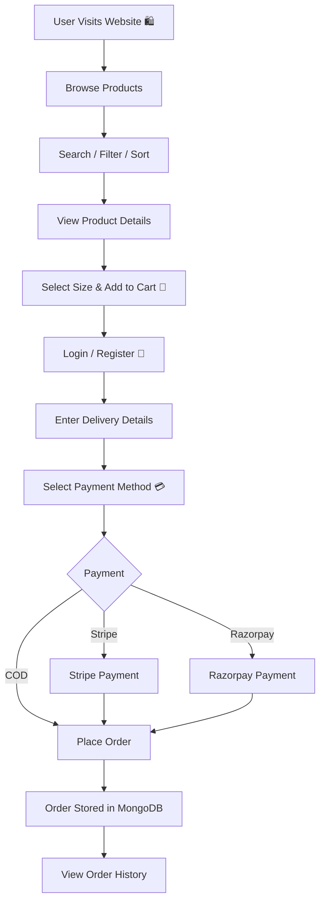

# 🛍️ E-commerce Website — Full Stack Online Shopping Application

⚡**E-commerce Website** is a full-stack online shopping web application built using **React.js, Node.js, Express.js, and MongoDB.**
It allows users to browse, search, and filter products, manage their cart, place orders, and make payments using **Cash on Delivery, Stripe, and Razorpay.** 🛒💳

<p align="center">


</p>

---

## 🚀 Tech Stack

<table>
<tr>
<td align="center"><br>React.js</td>
<td align="center"><br>JavaScript</td>
<td align="center"><br>Node.js</td>
<td align="center"><br>Express.js</td>
<td align="center"><br>MongoDB</td>
</tr>

<tr>
<td align="center"><br>Tailwind CSS</td>
<td align="center"><br>Vite</td>
<td align="center"><br>Git</td>
<td align="center"><br>GitHub</td>
<td align="center">☁️<br>Cloudinary</td>
</tr>
</table>

---

## 💫 Live Demo

**Coming soon**

---

## ⚙️ Key Features

| Feature                  | Description                                                 |
| ------------------------ | ----------------------------------------------------------- |
| 🔐 **Authentication**    | User registration and login with JWT authentication.        |
| 🛍️ **Product Browsing** | Browse products with search, filtering, and sorting.        |
| 📦 **Product Details**   | View product details and select available sizes.            |
| 🛒 **Shopping Cart**     | Add, update, and remove products from the cart.             |
| 📍 **Checkout**          | Enter delivery details and place orders.                    |
| 💳 **Payments**          | Supports Cash on Delivery, Stripe, and Razorpay.            |
| 📋 **Order Management**  | Users can view their orders and admins can manage orders.   |
| 👨‍💼 **Admin Panel**    | Admin can add, view, and delete products and manage orders. |
| ☁️ **Image Upload**      | Product images are uploaded and stored using Cloudinary.    |
| 🗄️ **MongoDB**          | Stores users, products, cart data, and orders.              |

---

## 📁 Project Structure

```text
ecommerce-website/
├── frontend/
│   ├── src/
│   │   ├── assets/
│   │   ├── components/
│   │   │   ├── Navbar.jsx
│   │   │   ├── Footer.jsx
│   │   │   ├── SearchBar.jsx
│   │   │   └── Title.jsx
│   │   ├── context/
│   │   │   └── ShopContext.jsx
│   │   ├── pages/
│   │   │   ├── Home.jsx
│   │   │   ├── Collection.jsx
│   │   │   ├── About.jsx
│   │   │   ├── Contact.jsx
│   │   │   ├── Product.jsx
│   │   │   ├── Cart.jsx
│   │   │   ├── PlaceOrder.jsx
│   │   │   └── Orders.jsx
│   │   ├── App.jsx
│   │   └── main.jsx
│   └── package.json
│
├── backend/
│   ├── config/
│   │   ├── mongodb.js
│   │   └── cloudinary.js
│   ├── controllers/
│   │   ├── userController.js
│   │   ├── productController.js
│   │   └── orderController.js
│   ├── middleware/
│   │   ├── auth.js
│   │   ├── adminAuth.js
│   │   └── multer.js
│   ├── models/
│   │   ├── userModel.js
│   │   ├── productModel.js
│   │   └── orderModel.js
│   ├── routes/
│   │   ├── userRouter.js
│   │   ├── productRouter.js
│   │   ├── cartRoute.js
│   │   └── orderRouter.js
│   ├── server.js
│   └── package.json
│
└── README.md
```

---

## 🔁 How It Works — Application Workflow



---

## 🧰 Installation & Setup

**1. Clone the repository**

```bash
git clone <your-github-repository-url>
cd ecommerce-website
```

**2. Install frontend dependencies**

```bash
cd frontend
npm install
```

**3. Install backend dependencies**

```bash
cd ../backend
npm install
```

**4. Environment variables**

Create a `.env` file inside the `backend` folder:

```env
MONGODB_URI=your_mongodb_connection_string
JWT_SECRET=your_jwt_secret

CLOUDINARY_NAME=your_cloudinary_name
CLOUDINARY_API_KEY=your_cloudinary_api_key
CLOUDINARY_SECRET_KEY=your_cloudinary_secret_key

STRIPE_SECRET_KEY=your_stripe_secret_key

RAZORPAY_KEY_ID=your_razorpay_key_id
RAZORPAY_KEY_SECRET=your_razorpay_key_secret
```

**5. Run the backend**

```bash
npm run server
```

**6. Run the frontend**

Open another terminal:

```bash
cd frontend
npm run dev
```

---

## 🚦 Core API Routes

### Users

| Method | Route                | Description   |
| ------ | -------------------- | ------------- |
| POST   | `/api/user/register` | Register user |
| POST   | `/api/user/login`    | Login user    |
| POST   | `/api/user/admin`    | Admin login   |

### Products

| Method | Route                 | Description    |
| ------ | --------------------- | -------------- |
| POST   | `/api/product/add`    | Add product    |
| POST   | `/api/product/remove` | Remove product |
| GET    | `/api/product/list`   | Get products   |

### Cart

| Method | Route              | Description           |
| ------ | ------------------ | --------------------- |
| POST   | `/api/cart/add`    | Add item to cart      |
| POST   | `/api/cart/remove` | Remove item from cart |
| POST   | `/api/cart/get`    | Get cart              |

### Orders

| Method | Route                   | Description         |
| ------ | ----------------------- | ------------------- |
| POST   | `/api/order/place`      | Place order         |
| POST   | `/api/order/stripe`     | Stripe payment      |
| POST   | `/api/order/razorpay`   | Razorpay payment    |
| POST   | `/api/order/userorders` | Get user orders     |
| POST   | `/api/order/list`       | Get all orders      |
| POST   | `/api/order/status`     | Update order status |

---

## 🗄️ Database

**MongoDB** is used as the primary database with **Mongoose**.

* **User** → Stores user account and authentication data
* **Product** → Stores product details, price, sizes, and images
* **Order** → Stores order items, delivery details, payment method, and order status

---

## 🚀 Deployment

* **Vercel** → Frontend
* **MongoDB Atlas** → Database
* **Cloudinary** → Product Image Storage
* **Backend Hosting** → Node.js / Express server

---

## 🤝 Contributing

Contributions, issues, and feature requests are welcome!

1. Fork the repository
2. Create a new branch
3. Make your changes
4. Commit and push your changes
5. Open a Pull Request 🚀

---

## 📜 License

This project is created for learning and portfolio purposes.

---

## 🔗 Connect With Me

<p align="left">
  <a href="https://github.com/VarshaChintapatla" target="_blank">
    
  </a>

  <a href="https://www.linkedin.com/in/varsha-chintapatla-391428332/" target="_blank">
    
  </a>
</p>

---

<h3 align="center">
  <em>Made with ❤️ by <strong>Chintapatla Varsha</strong></em>
</h3>
