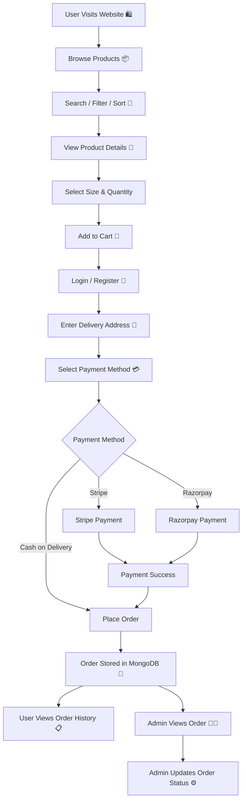
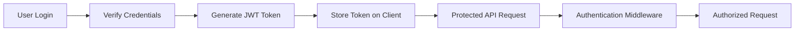

Copy everything below and paste it directly into your `README.md`:

````markdown
# 🛍️ E-commerce Website — Full Stack Online Shopping Application

⚡ **E-commerce Website** is a full-stack online shopping web application built using **React.js, Node.js, Express.js, and MongoDB**. It allows users to browse products, search and filter products, view product details, manage their shopping cart, place orders, and make payments. The project also includes a dedicated admin dashboard for managing products and customer orders.

---

## 🏷️ Technology Badges


---

# ⚡ Project Overview

The **E-commerce Website** provides a complete online shopping experience where users can discover products, view product details, select sizes and quantities, add products to their cart, and place orders.

Users can choose between **Cash on Delivery, Stripe, and Razorpay** payment options. The application also provides an admin dashboard where administrators can add and manage products and customer orders.

This project demonstrates practical implementation of **MERN stack development, REST APIs, authentication, database management, cloud image storage, cart management, order processing, and payment integration**.

---

# 🚀 Tech Stack

### 🎨 Frontend

- React.js
- JavaScript
- Tailwind CSS
- Vite
- React Router

### ⚙️ Backend

- Node.js
- Express.js
- REST APIs
- Mongoose

### 🗄️ Database

- MongoDB

### 🔐 Authentication & Security

- JWT
- bcrypt
- Authentication Middleware
- Admin Authorization Middleware

### ☁️ Cloud & External Services

- Cloudinary — Product image storage
- Stripe — Online payments
- Razorpay — Online payments

### 🛠️ Development Tools

- Git
- GitHub
- npm

---

# ✨ Key Features

| Feature | Description |
|---|---|
| 🛍️ Product Browsing | Users can browse available products. |
| 🔎 Search | Users can search for products. |
| 🔍 Filtering | Products can be filtered based on available categories and options. |
| ↕️ Sorting | Users can sort products using available sorting options. |
| 📦 Product Details | Users can view product information, images, prices, sizes, and other details. |
| 🛒 Shopping Cart | Users can add products and manage their cart. |
| 📏 Size Selection | Users can select a product size before adding it to the cart. |
| 🔢 Quantity Management | Users can increase, decrease, and update product quantities. |
| 🔐 User Authentication | Users can register and log in securely. |
| 📍 Delivery Details | Users can enter delivery information during checkout. |
| 💵 Cash on Delivery | Supports Cash on Delivery orders. |
| 💳 Stripe | Supports online payments using Stripe. |
| 💰 Razorpay | Supports online payments using Razorpay. |
| 📋 Order History | Logged-in users can view their previous orders. |
| 👨‍💼 Admin Dashboard | Provides a separate interface for store administration. |
| ➕ Add Products | Admin can add products with product details and images. |
| 🗑️ Delete Products | Admin can remove products from the store. |
| 📦 Order Management | Admin can view customer orders and update order status. |
| ☁️ Image Upload | Product images are uploaded using Cloudinary. |
| 🔗 REST API | Frontend communicates with the backend through REST APIs. |
| 📱 Responsive UI | User interface is designed using React.js and Tailwind CSS. |

---

# 📸 Screenshots

## 🏠 Home Page

Add your Home page screenshot here.

```text
📸 Home Page Screenshot
````

## 🛍️ Collection Page

Add your Collection page screenshot here.

```text
📸 Collection Page Screenshot
```

## 📦 Product Details

Add your Product Details screenshot here.

```text
📸 Product Details Screenshot
```

## 🛒 Shopping Cart

Add your Cart screenshot here.

```text
📸 Cart Screenshot
```

## 💳 Checkout / Place Order

Add your Checkout screenshot here.

```text
📸 Checkout Screenshot
```

## 👨‍💼 Admin Dashboard

Add your Admin Dashboard screenshot here.

```text
📸 Admin Dashboard Screenshot
```

---

# 💫 Live Demo

**Live Demo:** Coming soon

---

# 🔁 How It Works — Application Workflow



---

# 🛒 Shopping Workflow

```text
Home
  ↓
Collection
  ↓
Search / Filter / Sort
  ↓
Product Details
  ↓
Select Size
  ↓
Select Quantity
  ↓
Add to Cart
  ↓
Cart
  ↓
Checkout
  ↓
Delivery Address
  ↓
Payment
  ↓
Order Confirmation
```

---

# 👨‍💼 Admin Workflow

```text
Admin Login 🔐
      ↓
Admin Dashboard
      ↓
Add Product ➕
      ↓
Upload Product Images
      ↓
Cloudinary ☁️
      ↓
Product Data
      ↓
MongoDB 💾
      ↓
Product Available on Website
      ↓
View Customer Orders 📦
      ↓
Update Order Status ⚙️
```

---

# 🔐 Authentication & Authorization

The application uses **JWT-based authentication** for user authentication and protected operations.



### User Authentication

* Users can register for an account.
* User credentials are verified during login.
* Passwords are handled using `bcrypt`.
* A JWT token is generated after successful authentication.
* The token is used for protected API requests.

### Admin Authorization

The application contains separate admin authentication/authorization middleware.

Admin operations include:

* Adding products
* Removing products
* Managing orders
* Updating order status

---

# ☁️ Cloudinary Integration

**Cloudinary** is used for product image storage.

```text
Admin
  ↓
Select Product Images
  ↓
Multer
  ↓
Cloudinary
  ↓
Image URL
  ↓
MongoDB
```

This allows product images to be stored in the cloud while the corresponding image information is used by the application.

---

# 💳 Payment Integration

The application supports multiple payment methods.

## 💵 Cash on Delivery

```text
Checkout
   ↓
Select Cash on Delivery
   ↓
Place Order
   ↓
Order Created
```

## 💳 Stripe

```text
Checkout
   ↓
Select Stripe
   ↓
Stripe Payment
   ↓
Payment Processing
   ↓
Payment Success
   ↓
Order Created
```

## 💰 Razorpay

```text
Checkout
   ↓
Select Razorpay
   ↓
Razorpay Payment
   ↓
Payment Processing
   ↓
Payment Success
   ↓
Order Created
```

---

# 🚦 Core API Routes

## 👤 User APIs

| Method | Endpoint             | Description         |
| ------ | -------------------- | ------------------- |
| POST   | `/api/user/register` | Register a new user |
| POST   | `/api/user/login`    | Login user          |
| POST   | `/api/user/admin`    | Admin login         |

---

## 📦 Product APIs

| Method | Endpoint              | Description      |
| ------ | --------------------- | ---------------- |
| POST   | `/api/product/add`    | Add a product    |
| POST   | `/api/product/remove` | Remove a product |
| GET    | `/api/product/list`   | Get all products |

---

## 🛒 Cart APIs

| Method | Endpoint           | Description              |
| ------ | ------------------ | ------------------------ |
| POST   | `/api/cart/add`    | Add product to cart      |
| POST   | `/api/cart/remove` | Remove product from cart |
| POST   | `/api/cart/get`    | Get cart data            |

---

## 📋 Order APIs

| Method | Endpoint                | Description              |
| ------ | ----------------------- | ------------------------ |
| POST   | `/api/order/place`      | Place an order           |
| POST   | `/api/order/stripe`     | Process Stripe payment   |
| POST   | `/api/order/razorpay`   | Process Razorpay payment |
| POST   | `/api/order/userorders` | Get user's orders        |
| POST   | `/api/order/list`       | Get all orders           |
| POST   | `/api/order/status`     | Update order status      |

---

# 🗄️ Database

The application uses **MongoDB** as the database and **Mongoose** for interacting with MongoDB.

## 👤 User Model

Stores user account and authentication information.

```text
User
 ├── Name
 ├── Email
 └── Password
```

## 📦 Product Model

Stores product information.

```text
Product
 ├── Name
 ├── Description
 ├── Price
 ├── Category
 ├── Sub-category
 ├── Sizes
 └── Images
```

## 📋 Order Model

Stores customer order information.

```text
Order
 ├── User
 ├── Items
 ├── Amount
 ├── Delivery Address
 ├── Payment Method
 └── Order Status
```

MongoDB provides persistent storage for application data including **users, products, carts, and orders**.

---

# 🔗 External Services & APIs

| Service       | Purpose                   |
| ------------- | ------------------------- |
| ☁️ Cloudinary | Product image storage     |
| 💳 Stripe     | Online payment processing |
| 💰 Razorpay   | Online payment processing |
| 🍃 MongoDB    | Application database      |

---

# 🧠 Important Technical Concepts

This project demonstrates several concepts that are useful for full-stack development interviews.

### 🎨 Frontend

* React component-based architecture
* React Hooks
* Context API
* React Router
* State management
* API integration
* Form handling
* Cart state management
* Responsive UI development

### ⚙️ Backend

* Node.js
* Express.js
* REST API development
* Routing
* Controllers
* Middleware
* Authentication middleware
* Admin authorization

### 🗄️ Database

* MongoDB
* Mongoose
* Database models
* CRUD operations
* Persistent data storage

### 🔐 Security

* JWT authentication
* Password hashing using bcrypt
* Protected API routes
* Admin authorization

### 💳 Payments

* Stripe integration
* Razorpay integration
* Payment workflow
* Order processing

### ☁️ Cloud

* Cloudinary image uploads
* Cloud-based image storage

---

# 📁 Project Structure

```text
ecommerce-website/
│
├── frontend/
│   │
│   ├── src/
│   │   ├── assets/
│   │
│   │   ├── components/
│   │   │   ├── Navbar.jsx
│   │   │   ├── Footer.jsx
│   │   │   ├── SearchBar.jsx
│   │   │   └── Title.jsx
│   │
│   │   ├── pages/
│   │   │   ├── Home.jsx
│   │   │   ├── Collection.jsx
│   │   │   ├── About.jsx
│   │   │   ├── Contact.jsx
│   │   │   ├── Product.jsx
│   │   │   ├── Cart.jsx
│   │   │   ├── PlaceOrder.jsx
│   │   │   └── Orders.jsx
│   │
│   │   ├── context/
│   │   │   └── ShopContext.jsx
│   │
│   │   ├── App.jsx
│   │   └── main.jsx
│   │
│   ├── package.json
│   └── vite.config.js
│
├── backend/
│   │
│   ├── config/
│   │   ├── mongodb.js
│   │   └── cloudinary.js
│   │
│   ├── controllers/
│   │   ├── userController.js
│   │   ├── productController.js
│   │   └── orderController.js
│   │
│   ├── middleware/
│   │   ├── auth.js
│   │   ├── adminAuth.js
│   │   └── multer.js
│   │
│   ├── models/
│   │   ├── userModel.js
│   │   ├── productModel.js
│   │   └── orderModel.js
│   │
│   ├── routes/
│   │   ├── userRouter.js
│   │   ├── productRouter.js
│   │   ├── cartRoute.js
│   │   └── orderRouter.js
│   │
│   ├── server.js
│   └── package.json
│
├── README.md
└── .gitignore
```

---

# 📂 Important Folders

| Folder                    | Purpose                                                   |
| ------------------------- | --------------------------------------------------------- |
| `frontend/src/components` | Reusable React components                                 |
| `frontend/src/pages`      | Application pages                                         |
| `frontend/src/context`    | Global shopping/cart state                                |
| `frontend/src/assets`     | Frontend assets                                           |
| `backend/config`          | Database and Cloudinary configuration                     |
| `backend/controllers`     | Backend business logic                                    |
| `backend/middleware`      | Authentication, authorization, and file-upload middleware |
| `backend/models`          | MongoDB/Mongoose models                                   |
| `backend/routes`          | REST API routes                                           |
| `backend/server.js`       | Backend server entry point                                |

---

# 🧰 Installation & Setup

## 1. Clone the Repository

```bash
git clone <your-github-repository-url>
cd ecommerce-website
```

---

## 2. Install Frontend Dependencies

```bash
cd frontend
npm install
```

---

## 3. Install Backend Dependencies

Open another terminal:

```bash
cd backend
npm install
```

---

# 🔐 Environment Variables

Create a `.env` file inside the `backend` folder.

```env
MONGODB_URI=your_mongodb_connection_string

JWT_SECRET=your_jwt_secret

CLOUDINARY_NAME=your_cloudinary_name
CLOUDINARY_API_KEY=your_cloudinary_api_key
CLOUDINARY_SECRET_KEY=your_cloudinary_secret_key

STRIPE_SECRET_KEY=your_stripe_secret_key

RAZORPAY_KEY_ID=your_razorpay_key_id
RAZORPAY_KEY_SECRET=your_razorpay_key_secret
```

### Environment Variable Description

| Variable                | Purpose                                       |
| ----------------------- | --------------------------------------------- |
| `MONGODB_URI`           | Connects the backend to MongoDB               |
| `JWT_SECRET`            | Secret used to generate and verify JWT tokens |
| `CLOUDINARY_NAME`       | Cloudinary cloud name                         |
| `CLOUDINARY_API_KEY`    | Cloudinary API key                            |
| `CLOUDINARY_SECRET_KEY` | Cloudinary API secret                         |
| `STRIPE_SECRET_KEY`     | Stripe server-side authentication             |
| `RAZORPAY_KEY_ID`       | Razorpay API key ID                           |
| `RAZORPAY_KEY_SECRET`   | Razorpay API secret                           |

⚠️ **Never commit `.env` files or expose API keys, passwords, or secrets on GitHub.**

---

# ▶️ Running the Project

## Start Backend

```bash
cd backend
npm run server
```

Backend runs on:

```text
http://localhost:4000
```

---

## Start Frontend

Open another terminal:

```bash
cd frontend
npm run dev
```

Open the local URL displayed by Vite in your browser.

---

# 🚀 Deployment

The project can be deployed using the following services:

| Service            | Purpose               |
| ------------------ | --------------------- |
| ▲ Vercel           | Frontend deployment   |
| 🟢 Node.js Hosting | Backend deployment    |
| 🍃 MongoDB Atlas   | Database hosting      |
| ☁️ Cloudinary      | Product image storage |
| 💳 Stripe          | Payment gateway       |
| 💰 Razorpay        | Payment gateway       |

---

# 🔮 Future Improvements

* ❤️ Wishlist functionality
* ⭐ Product ratings and reviews
* 🎟️ Coupon and discount system
* 📧 Order confirmation emails
* 🔔 Order notifications
* 📊 Advanced admin analytics
* 🤖 Personalized product recommendations
* 🔍 Advanced product search
* 📱 Further mobile UI improvements

---

# 🤝 Contributing

Contributions, issues, and feature requests are welcome!

### How to Contribute

```bash
# Fork the repository

# Clone your fork
git clone <your-fork-url>

# Create a new branch
git checkout -b feature-name

# Make your changes

# Stage your changes
git add .

# Commit your changes
git commit -m "Add: your feature"

# Push your branch
git push origin feature-name
```

Then open a Pull Request.

---

# 👨‍💻 Author

## Chintapatla Varsha

**B.Tech — Computer Science and Engineering**

🔗 **GitHub:** Add your GitHub URL

🔗 **LinkedIn:** Add your LinkedIn URL

🔗 **Portfolio:** Add your portfolio URL

---

# 📄 License

This project is created for learning and portfolio purposes.

---

# ⭐ Project Summary

⚡ **E-commerce Website** is a MERN-based full-stack shopping application demonstrating a complete e-commerce workflow from **product browsing and cart management to checkout, payment processing, and order management**.

The project combines a **React.js frontend**, **Node.js and Express.js backend**, **MongoDB database**, **JWT authentication**, **Cloudinary image storage**, and **Stripe/Razorpay payment integration** into a complete online shopping platform.

---

## 🏷️ Topics

`react` `nodejs` `expressjs` `mongodb` `mongoose` `javascript` `tailwindcss` `vite` `ecommerce` `mern` `rest-api` `jwt` `cloudinary` `stripe` `razorpay`

---

Made with ❤️ by **Chintapatla Varsha**

```
```
