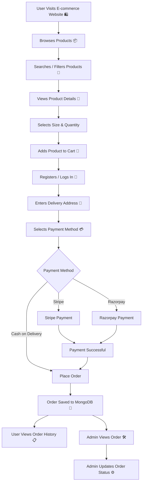

# E-commerce Website — Full Stack Online Shopping Web Application

⚡ **E-commerce Website** is a full-stack online shopping web application built using **React.js, Node.js, Express.js, and MongoDB**. It allows users to explore products, search and filter items, manage their shopping cart, place orders, and make online payments. The application also includes a dedicated admin dashboard for managing products and customer orders. 🛍️🛒

---

## 🚀 Tech Stack

**React.js**
**JavaScript**
**Tailwind CSS**
**Vite**

**Node.js**
**Express.js**
**MongoDB**
**Mongoose**

**JWT**
**bcrypt**
**Cloudinary**

**Stripe**
**Razorpay**

**Git**
**GitHub**

---

## 💫 Live Demo

Experience the live version here:

👉 **Live Demo:** Add your deployed Vercel URL here

---

# ⚙️ Key Features

| Feature                | Description                                                                                 |
| ---------------------- | ------------------------------------------------------------------------------------------- |
| 🛍️ Product Management | Users can browse and view products with details such as price, category, sizes, and images. |
| 🔎 Search & Filtering  | Users can search, filter, and sort products based on their requirements.                    |
| 🛒 Shopping Cart       | Users can add products, select sizes, update quantities, and remove items from the cart.    |
| 🔐 Authentication      | Secure user registration and login using JWT authentication.                                |
| 🛡️ Authorization      | Protected routes restrict admin operations and authenticated user actions.                  |
| 📦 Order Management    | Users can place orders and view their order history.                                        |
| 📍 Delivery Address    | Users can provide their delivery address during checkout.                                   |
| 💵 Cash on Delivery    | Supports Cash on Delivery as a payment option.                                              |
| 💳 Stripe Payment      | Integrated Stripe for online payment processing.                                            |
| 💰 Razorpay Payment    | Integrated Razorpay for online payment processing.                                          |
| 👨‍💼 Admin Dashboard  | Dedicated dashboard for managing products and customer orders.                              |
| ➕ Add Products         | Admin can add products with multiple images, sizes, categories, and pricing.                |
| 🗑️ Delete Products    | Admin can remove products from the store.                                                   |
| 📋 Order Status        | Admin can view customer orders and update their status.                                     |
| ☁️ Cloud Integration   | Cloudinary is used for product image storage and management.                                |
| 🔗 REST APIs           | Backend APIs handle authentication, products, carts, orders, and payments.                  |
| 📱 Responsive UI       | Responsive shopping interface built using React.js and Tailwind CSS.                        |

---

# 📁 Project Structure

```text
ecommerce-website/
│
├── frontend/
│   ├── public/
│   │
│   ├── src/
│   │   ├── assets/
│   │   ├── components/
│   │   │   ├── Navbar.jsx
│   │   │   ├── Footer.jsx
│   │   │   ├── SearchBar.jsx
│   │   │   └── Title.jsx
│   │   │
│   │   ├── pages/
│   │   │   ├── Home.jsx
│   │   │   ├── Collection.jsx
│   │   │   ├── About.jsx
│   │   │   ├── Contact.jsx
│   │   │   ├── Product.jsx
│   │   │   ├── Cart.jsx
│   │   │   ├── PlaceOrder.jsx
│   │   │   └── Orders.jsx
│   │   │
│   │   ├── context/
│   │   │   └── ShopContext.jsx
│   │   │
│   │   ├── App.jsx
│   │   └── main.jsx
│   │
│   ├── package.json
│   └── vite.config.js
│
├── backend/
│   ├── config/
│   │   ├── mongodb.js
│   │   └── cloudinary.js
│   │
│   ├── controllers/
│   │   ├── userController.js
│   │   ├── productController.js
│   │   └── orderController.js
│   │
│   ├── middleware/
│   │   ├── auth.js
│   │   ├── adminAuth.js
│   │   └── multer.js
│   │
│   ├── models/
│   │   ├── userModel.js
│   │   ├── productModel.js
│   │   └── orderModel.js
│   │
│   ├── routes/
│   │   ├── userRouter.js
│   │   ├── productRouter.js
│   │   ├── cartRoute.js
│   │   └── orderRouter.js
│   │
│   ├── server.js
│   ├── package.json
│   └── .env
│
├── README.md
└── .gitignore
```

---

# 🔁 How It Works — Application Workflow



---

# 🧑‍💻 Admin Workflow

```text
Admin Login 🔐
      ↓
Admin Dashboard
      ↓
Add Product ➕
      ↓
Upload Product Images
      ↓
Cloudinary ☁️
      ↓
Product Data Saved to MongoDB
      ↓
Product Available on Website
      ↓
View Customer Orders 📦
      ↓
Update Order Status ⚙️
```

---

# 🛒 Shopping Workflow

```text
Home
 ↓
Collection
 ↓
Search / Filter / Sort
 ↓
Product Details
 ↓
Select Size
 ↓
Add to Cart
 ↓
Cart
 ↓
Checkout
 ↓
Delivery Address
 ↓
Payment
 ↓
Order Confirmation
```

---

# 🔐 Authentication Flow

The application uses **JWT authentication** to protect user-specific operations.

```text
User Login
    ↓
Credentials Verified
    ↓
JWT Token Generated
    ↓
Token Stored on Client
    ↓
Token Sent With Protected Requests
    ↓
Authentication Middleware
    ↓
Authorized Request
```

Passwords are securely handled using **bcrypt**.

---

# ☁️ Cloudinary Image Upload

Product images are uploaded to Cloudinary and the resulting image URLs are stored with the product information.

```text
Admin
  ↓
Select Product Images
  ↓
Multer Middleware
  ↓
Cloudinary
  ↓
Image URL
  ↓
MongoDB
```

---

# 💳 Payment Integration

The application supports multiple payment methods.

### Cash on Delivery

```text
Checkout
   ↓
Cash on Delivery
   ↓
Place Order
   ↓
Order Saved
```

### Stripe

```text
Checkout
   ↓
Stripe
   ↓
Payment Processing
   ↓
Payment Success
   ↓
Order Created
```

### Razorpay

```text
Checkout
   ↓
Razorpay
   ↓
Payment Processing
   ↓
Payment Success
   ↓
Order Created
```

---

# 🚦 Core API Routes

## 👤 Users

| Method | Route                | Description         |
| ------ | -------------------- | ------------------- |
| POST   | `/api/user/register` | Register a new user |
| POST   | `/api/user/login`    | Login user          |
| POST   | `/api/user/admin`    | Admin login         |

## 📦 Products

| Method | Route                 | Description      |
| ------ | --------------------- | ---------------- |
| POST   | `/api/product/add`    | Add a product    |
| POST   | `/api/product/remove` | Remove a product |
| GET    | `/api/product/list`   | Get all products |

## 🛒 Cart

| Method | Route              | Description              |
| ------ | ------------------ | ------------------------ |
| POST   | `/api/cart/add`    | Add product to cart      |
| POST   | `/api/cart/remove` | Remove product from cart |
| POST   | `/api/cart/get`    | Get user's cart          |

## 📋 Orders

| Method | Route                   | Description             |
| ------ | ----------------------- | ----------------------- |
| POST   | `/api/order/place`      | Place an order          |
| POST   | `/api/order/stripe`     | Create Stripe payment   |
| POST   | `/api/order/razorpay`   | Create Razorpay payment |
| POST   | `/api/order/userorders` | Get user's orders       |
| POST   | `/api/order/list`       | Get all orders          |
| POST   | `/api/order/status`     | Update order status     |

---

# 🧰 Installation & Setup

## 1. Clone the repository

```bash
git clone <your-github-repository-url>
cd ecommerce-website
```

## 2. Install Frontend Dependencies

```bash
cd frontend
npm install
```

## 3. Install Backend Dependencies

Open another terminal:

```bash
cd backend
npm install
```

## 4. Environment Variables

Create a `.env` file inside the `backend` folder:

```env
MONGODB_URI=your_mongodb_connection_string

JWT_SECRET=your_jwt_secret

CLOUDINARY_NAME=your_cloudinary_name
CLOUDINARY_API_KEY=your_cloudinary_api_key
CLOUDINARY_SECRET_KEY=your_cloudinary_secret_key

STRIPE_SECRET_KEY=your_stripe_secret_key

RAZORPAY_KEY_ID=your_razorpay_key_id
RAZORPAY_KEY_SECRET=your_razorpay_key_secret
```

## 5. Run the Backend

```bash
cd backend
npm run server
```

Backend:

```text
http://localhost:4000
```

## 6. Run the Frontend

Open another terminal:

```bash
cd frontend
npm run dev
```

Open the local URL displayed by Vite in your browser.

---

# 🚀 Deployment

Recommended deployment stack:

**Vercel** → Frontend

**Render / Node.js Hosting** → Backend

**MongoDB Atlas** → Database

**Cloudinary** → Product Image Storage

**Stripe** → Payment Gateway

**Razorpay** → Payment Gateway

---

# 🤝 Contributing

Contributions, issues, and feature requests are welcome!

### How to Contribute

1. Fork the repository
2. Clone your fork

```bash
git clone <your-fork-url>
```

3. Create a new branch

```bash
git checkout -b feature-name
```

4. Make your changes
5. Commit your changes

```bash
git commit -m "Add: your feature name"
```

6. Push the branch

```bash
git push origin feature-name
```

7. Open a Pull Request 🚀

---

# 📜 License

This project is created for learning and portfolio purposes.

---

# 🔗 Connect With Me

**Chintapatla Varsha**

B.Tech — Computer Science and Engineering

GitHub: **VarshaChintapatla**

LinkedIn: **varsha-chintapatla-391428332**

LeetCode: **varshachintapatla**

---

# About

⚡ **E-commerce Website** is a full-stack online shopping application built using the **MERN stack**. It demonstrates practical implementation of **authentication, product management, shopping cart functionality, order processing, REST APIs, cloud image storage, admin management, and payment gateway integration**.

The application provides a complete shopping workflow from **product discovery to checkout and order management**, with a separate admin dashboard for managing the store.

---

## Topics

`react` `nodejs` `expressjs` `mongodb` `mongoose` `javascript` `tailwindcss` `vite` `ecommerce` `mern` `rest-api` `jwt` `cloudinary` `stripe` `razorpay`

---

## Languages

**JavaScript**
**JSX**
**CSS**

---

## Project Highlights

🛍️ Full-stack E-commerce Application
🔐 JWT Authentication
🛒 Shopping Cart
📦 Order Management
💳 Stripe Integration
💰 Razorpay Integration
☁️ Cloudinary Integration
👨‍💼 Admin Dashboard
🍃 MongoDB Database
⚡ REST APIs
